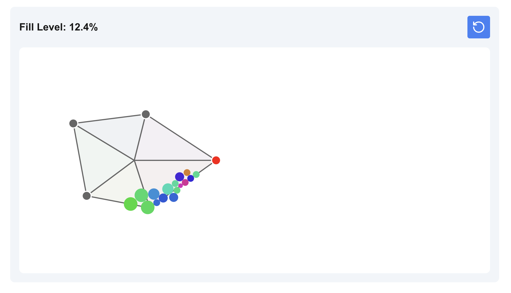

### Flower Filler

This is a simple game where you have to pack balls (droplets) into an outline of a flower. The balls are of different sizes and the shape has a limited capacity. The goal is to pack at least 90% and the reward is the full flower image. The images come from this dataset: https://huggingface.co/datasets/huggan/flowers-102-categories

you can play the game here: https://semajyllek.github.io/flower-filler/

successful pushes to the `main` branch will trigger a deployment to github pages.